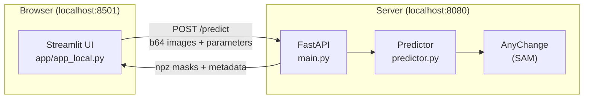
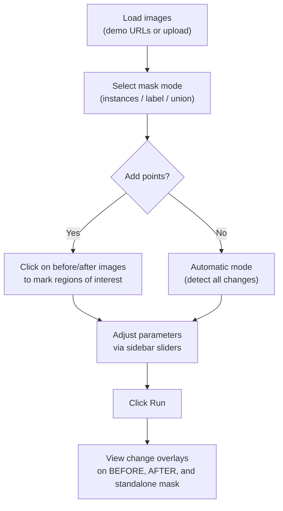

# Segment Any Change — Streamlit App

<!-- TODO: Add demo GIF once app is working end-to-end -->
<!--  -->

Interactive web UI for zero-shot change detection using [AnyChange (Segment Any Change)](https://arxiv.org/abs/2402.01188). Upload or load before/after satellite image pairs, optionally click points of interest, and visualize detected changes — no model training required.

## Features

- **Three detection modes**: automatic (detect all changes), single-point (click one location), multi-point (click multiple regions)
- **Three mask visualizations**: instances (individual change regions with boundaries), label map (color-coded regions), union (binary change mask)
- **Interactive point drawing**: click directly on before/after images to guide detection
- **Parameter controls**: tune SAM grid density, stability threshold, change confidence, and object similarity via sidebar sliders
- **Demo images**: built-in before/after pair for quick testing

## Architecture



## Quick Start

### Prerequisites

From the repo root:

```bash
uv venv --python 3.10
source .venv/bin/activate
uv pip install -e ".[app]"
```

Download the SAM checkpoint:

```bash
mkdir -p sam_weights
curl -L -o sam_weights/sam_vit_h_4b8939.pth \
  https://dl.fbaipublicfiles.com/segment_anything/sam_vit_h_4b8939.pth
```

### Run

**Terminal 1** — start the FastAPI server:

```bash
cd deployment/app
SAM_CKPT_URI=../../sam_weights/sam_vit_h_4b8939.pth \
python -m uvicorn main:app --host 0.0.0.0 --port 8080
```

**Terminal 2** — start the Streamlit app:

```bash
streamlit run app/app_local.py
```

The app opens at `http://localhost:8501`.

## Usage



## Parameters

| Parameter | Range | Default | Effect |
|-----------|-------|---------|--------|
| `points_per_side` | 4–64 | 32 | Grid density for SAM mask generation. Higher = more candidate masks, slower |
| `stability_thresh` | 0.50–0.99 | 0.95 | Minimum stability score for SAM masks. Higher = fewer but more confident masks |
| `change_conf_thresh` | 50–200 | 145 | Change confidence angle threshold (degrees). Lower = more sensitive to changes |
| `object_sim_thresh` | 10–120 | 60 | Object similarity for point queries. Lower = stricter matching |

## Mask Modes

- **Instances** — each detected change region rendered as a separate colored polygon with cyan boundaries
- **Label** — integer label map where each region gets a unique ID, rendered as a color map
- **Union** — binary mask combining all detected changes into a single green overlay
