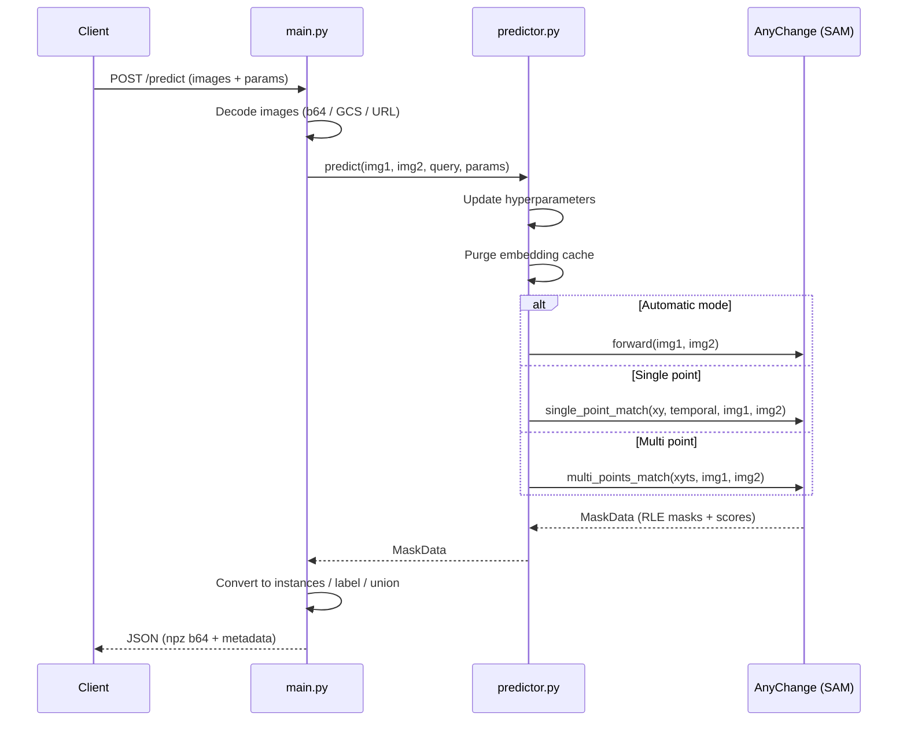
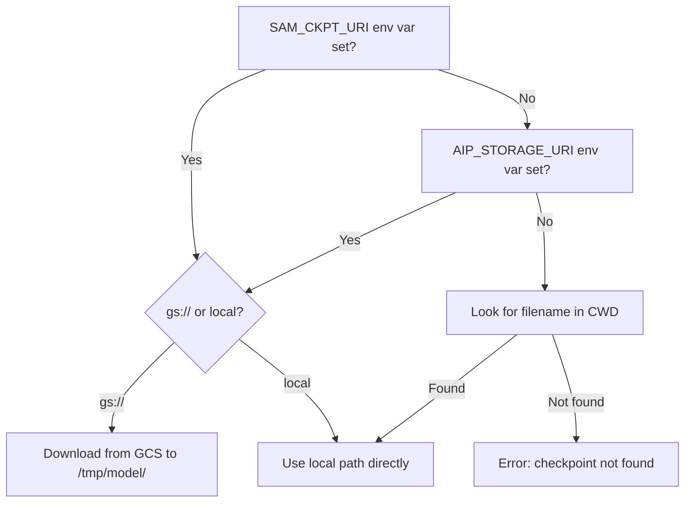

# Deployment — AnyChange FastAPI Server

FastAPI inference server wrapping the [AnyChange](https://arxiv.org/abs/2402.01188) model for zero-shot change detection. Serves as the backend for the [Streamlit app](../app/README.md) and can be deployed locally, on Vertex AI, or Cloud Run.

## Directory Structure

```
deployment/
├── app/
│   ├── config.py          # All defaults (env-overridable)
│   ├── main.py            # FastAPI routes (/health, /predict)
│   ├── predictor.py       # AnyChange wrapper (thread-safe, per-request params)
│   └── utils.py           # Mask conversion + image loading helpers
├── test_server.py         # Quick smoke test (sends demo images to local server)
└── README.md
```

## Request Flow



## Local Usage

```bash
cd deployment/app
SAM_CKPT_URI=../../sam_weights/sam_vit_h_4b8939.pth \
python -m uvicorn main:app --host 0.0.0.0 --port 8080
```

Test with:

```bash
cd deployment
python test_server.py
```

## API

### `GET /health`

Returns `{"status": "ok"}`.

### `POST /predict`

Accepts one or more image pairs with optional point queries and parameter overrides.

**Request body:**

```json
{
  "parameters": {
    "mask_mode": "instances",
    "points_per_side": 32,
    "stability_thresh": 0.95,
    "change_conf_thresh": 145,
    "object_sim_thresh": 60
  },
  "instances": [
    {
      "img1": {"b64": "<base64 PNG/JPEG>"},
      "img2": {"b64": "<base64 PNG/JPEG>"},
      "points": [{"xy": [926, 44], "temporal": 2}]
    }
  ]
}
```

**Image input formats:**

| Format | Example |
|--------|---------|
| Base64 PNG/JPEG | `{"b64": "<base64>"}` |
| GCS URI | `{"uri": "gs://bucket/path/img.png"}` |
| HTTP URL | `{"uri": "https://example.com/img.png"}` |
| NumPy `.npy` (base64) | `{"npy_b64": "<base64>"}` |
| NumPy `.npz` (base64) | `{"npz_b64": "<base64>", "key": "arr"}` |

**Query modes:**

| Mode | How to trigger |
|------|---------------|
| Automatic | Omit `point`/`points` — detects all changes |
| Single point | `"point": {"xy": [x, y], "temporal": 1\|2}` |
| Multi point | `"points": [{"xy": [x, y], "temporal": 1\|2}, ...]` |

**Response:**

```json
{
  "predictions": [
    {
      "mask_mode": "instances",
      "mask_array": {"format": "npz", "b64": "<base64>"},
      "shape": [38, 1024, 1024],
      "dtype": "uint8",
      "mode": "auto",
      "instances_count": 38,
      "used_parameters": { ... }
    }
  ]
}
```

## Checkpoint Resolution

The server resolves the SAM checkpoint using this priority:



## Configuration

All defaults are in `app/config.py` and can be overridden via environment variables:

| Variable | Default | Description |
|----------|---------|-------------|
| `SAM_CKPT_URI` | — | Path or `gs://` URI to SAM checkpoint (required) |
| `SAM_CHECKPOINT_FILENAME` | `sam_vit_h_4b8939.pth` | Checkpoint filename (used when URI points to a folder) |
| `ANYCHANGE_MODEL_TYPE` | `vit_h` | SAM variant: `vit_b`, `vit_l`, or `vit_h` |
| `POINTS_PER_SIDE` | `32` | Grid density for automatic mask generation |
| `STABILITY_THRESH` | `0.95` | SAM mask stability score threshold |
| `CHANGE_CONF_THRESH` | `145` | Change confidence angle threshold |
| `OBJECT_SIM_THRESH` | `60` | Object similarity threshold for point queries |
| `USE_NORMALIZED_FEATURE` | `true` | Use normalized SAM features for matching |
| `BITEMPORAL_MATCH` | `true` | Match masks from both temporal directions |
| `DEFAULT_MASK_MODE` | `instances` | Default output: `instances`, `label`, or `union` |
| `AIP_HEALTH_ROUTE` | `/health` | Health endpoint path (Vertex AI convention) |
| `AIP_PREDICT_ROUTE` | `/predict` | Predict endpoint path (Vertex AI convention) |

<!-- TODO: Add Vertex AI and Cloud Run deployment instructions once deploy scripts are ported -->
