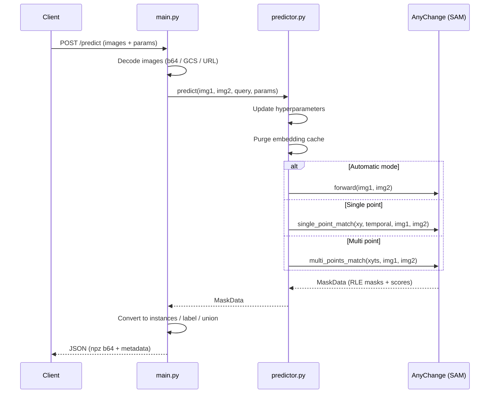
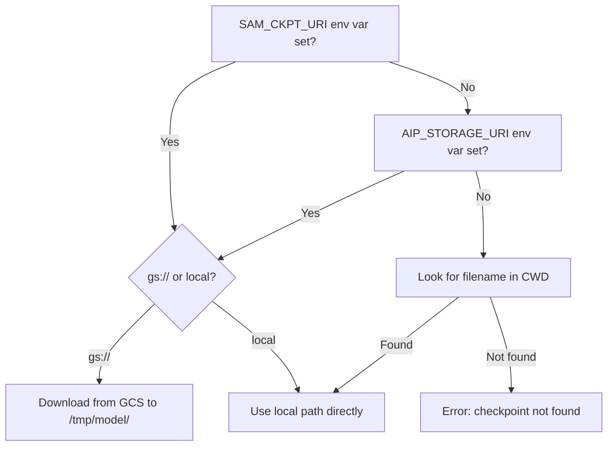
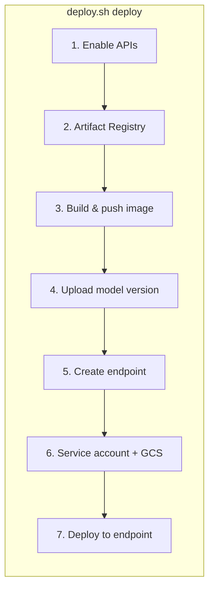

# Deployment — AnyChange FastAPI Server

FastAPI inference server wrapping the [AnyChange](https://arxiv.org/abs/2402.01188) model for zero-shot change detection. Serves as the backend for the [Streamlit app](../app/README.md) and can be deployed locally, on Vertex AI, or Cloud Run.

## Directory Structure

```
deployment/
├── app/
│   ├── config.py          # All defaults (env-overridable)
│   ├── main.py            # FastAPI routes (/health, /predict)
│   ├── predictor.py       # AnyChange wrapper (thread-safe, per-request params)
│   └── utils.py           # Mask conversion + image loading helpers
├── Dockerfile             # CUDA 12.4 + Python 3.11 container (deps from pyproject.toml)
├── deploy.sh              # Vertex AI deployment CLI (deploy/stop/clean/status/logs)
├── .env.example           # Config template
├── test_server.py         # Quick smoke test (sends demo images to local server)
└── README.md
```

## Request Flow



## Local Usage

```bash
cd deployment/app
SAM_CKPT_URI=../../sam_weights/sam_vit_h_4b8939.pth \
python -m uvicorn main:app --host 0.0.0.0 --port 8080
```

Test with:

```bash
cd deployment
python test_server.py
```

## API

### `GET /health`

Returns `{"status": "ok"}`.

### `POST /predict`

Accepts one or more image pairs with optional point queries and parameter overrides.

**Request body:**

```json
{
  "parameters": {
    "mask_mode": "instances",
    "points_per_side": 32,
    "stability_thresh": 0.95,
    "change_conf_thresh": 145,
    "object_sim_thresh": 60
  },
  "instances": [
    {
      "img1": {"b64": "<base64 PNG/JPEG>"},
      "img2": {"b64": "<base64 PNG/JPEG>"},
      "points": [{"xy": [926, 44], "temporal": 2}]
    }
  ]
}
```

**Image input formats:**

| Format | Example |
|--------|---------|
| Base64 PNG/JPEG | `{"b64": "<base64>"}` |
| GCS URI | `{"uri": "gs://bucket/path/img.png"}` |
| HTTP URL | `{"uri": "https://example.com/img.png"}` |
| NumPy `.npy` (base64) | `{"npy_b64": "<base64>"}` |
| NumPy `.npz` (base64) | `{"npz_b64": "<base64>", "key": "arr"}` |

**Query modes:**

| Mode | How to trigger |
|------|---------------|
| Automatic | Omit `point`/`points` — detects all changes |
| Single point | `"point": {"xy": [x, y], "temporal": 1\|2}` |
| Multi point | `"points": [{"xy": [x, y], "temporal": 1\|2}, ...]` |

**Response:**

```json
{
  "predictions": [
    {
      "mask_mode": "instances",
      "mask_array": {"format": "npz", "b64": "<base64>"},
      "shape": [38, 1024, 1024],
      "dtype": "uint8",
      "mode": "auto",
      "instances_count": 38,
      "used_parameters": { ... }
    }
  ]
}
```

### More Examples

**NPZ arrays with band selection (e.g. remote sensing multi-band data):**

```json
{
  "parameters": {"mask_mode": "label"},
  "instances": [{
    "img1": {"npz_b64": "<base64 of .npz>", "key": "arr"},
    "img2": {"npz_b64": "<base64 of .npz>", "key": "arr"},
    "bands": [2, 1, 0],
    "channel_order": "hwc"
  }]
}
```

**CHW float arrays via the generic `array` envelope:**

```json
{
  "parameters": {"mask_mode": "union"},
  "instances": [{
    "img1": {"array": {"format": "npy", "b64": "<base64>"},
             "channel_order": "chw", "bands": [0, 1, 2]},
    "img2": {"array": {"format": "npz", "b64": "<base64>", "key": "rgb"},
             "channel_order": "chw"}
  }]
}
```

**GCS URIs (used in Vertex AI deployments):**

```json
{
  "parameters": {"mask_mode": "instances"},
  "instances": [{
    "img1": {"uri": "gs://bucket/path/t1.npz", "key": "arr"},
    "img2": {"uri": "gs://bucket/path/t2.npz", "key": "arr"},
    "bands": ["r", "g", "b"]
  }]
}
```

## Checkpoint Resolution

The server resolves the SAM checkpoint using this priority:



## Configuration

All defaults are in `app/config.py` and can be overridden via environment variables:

| Variable | Default | Description |
|----------|---------|-------------|
| `SAM_CKPT_URI` | — | Path or `gs://` URI to SAM checkpoint (required) |
| `SAM_CHECKPOINT_FILENAME` | `sam_vit_h_4b8939.pth` | Checkpoint filename (used when URI points to a folder) |
| `ANYCHANGE_MODEL_TYPE` | `vit_h` | SAM variant: `vit_b`, `vit_l`, or `vit_h` |
| `POINTS_PER_SIDE` | `32` | Grid density for automatic mask generation |
| `STABILITY_THRESH` | `0.95` | SAM mask stability score threshold |
| `CHANGE_CONF_THRESH` | `145` | Change confidence angle threshold |
| `OBJECT_SIM_THRESH` | `60` | Object similarity threshold for point queries |
| `USE_NORMALIZED_FEATURE` | `true` | Use normalized SAM features for matching |
| `BITEMPORAL_MATCH` | `true` | Match masks from both temporal directions |
| `DEFAULT_MASK_MODE` | `instances` | Default output: `instances`, `label`, or `union` |
| `AIP_HEALTH_ROUTE` | `/health` | Health endpoint path (Vertex AI convention) |
| `AIP_PREDICT_ROUTE` | `/predict` | Predict endpoint path (Vertex AI convention) |

## Vertex AI Deployment

The `deploy.sh` script provides a CLI for the full Vertex AI lifecycle:

```bash
cd deployment
./deploy.sh          # show usage
./deploy.sh deploy   # build, upload, deploy
./deploy.sh status   # show endpoint and model info
./deploy.sh logs     # show recent prediction logs
./deploy.sh stop     # undeploy model, delete endpoint (keeps images + model)
./deploy.sh clean    # delete everything (endpoint, model, images)
```

### Deploy pipeline



### Setup

1. Authenticate: `gcloud auth login`
2. Upload SAM checkpoint to GCS: `gsutil cp sam_vit_h_4b8939.pth gs://your-bucket/`
3. Create `.env` from template:

```bash
cp .env.example .env
# Edit .env with your PROJECT_ID and BUCKET_URI
```

4. Deploy:

```bash
./deploy.sh deploy
```

To skip the image build and reuse an existing image:

```bash
# Set in .env or export before running
export EXISTING_IMAGE_URI="us-central1-docker.pkg.dev/your-project/your-repo/your-image:tag"
./deploy.sh deploy
```

### Configuration

All config is loaded from `.env` (see `.env.example`):

| Variable | Required | Default | Description |
|----------|----------|---------|-------------|
| `PROJECT_ID` | Yes | — | GCP project |
| `BUCKET_URI` | Yes | — | GCS bucket with SAM checkpoint |
| `REGION` | No | `us-central1` | Deployment region |
| `REPO_NAME` | No | `segment-any-change-repo` | Artifact Registry repo name |
| `IMAGE_NAME` | No | `segment-any-change-model-server` | Docker image name |
| `MODEL_DISPLAY_NAME` | No | `segment-any-change-model` | Vertex AI model registry name |
| `ENDPOINT_DISPLAY_NAME` | No | `segment-any-change-model-endpoint` | Vertex AI endpoint name |
| `MACHINE_TYPE` | No | `n1-standard-8` | VM machine type |
| `ACCELERATOR` | No | `type=nvidia-tesla-t4,count=1` | GPU accelerator |
| `MIN_REPLICAS` | No | `1` | Minimum replica count |
| `MAX_REPLICAS` | No | `1` | Maximum replica count |
| `EXISTING_IMAGE_URI` | No | — | Skip build and use this image |

### Commands

| Command | What it does |
|---------|-------------|
| `deploy` | Full pipeline: enable APIs, build image, upload model version, create endpoint, deploy with T4 GPU |
| `redeploy` | Deploy latest model version to existing endpoint (skips build/upload — for retrying after quota errors or changing machine config) |
| `status` | Show endpoint info, deployed models, model versions |
| `logs` | Show last 50 prediction logs (last hour) |
| `stop` | Undeploy model from endpoint, delete endpoint. Keeps model + images for redeployment |
| `clean` | Stop + delete model + delete container images from Artifact Registry |

### Docker Image

The `Dockerfile` builds a CUDA 12.4 container with:
- Python 3.11
- PyTorch 2.4.1 (cu124) — installed first from the CUDA-specific index
- `torchange[app]` — installed from the fork's `pyproject.toml` (single source of truth for all non-PyTorch deps)
- FastAPI + uvicorn

No `requirements.txt` — all dependencies are managed through `pyproject.toml`. PyTorch is the only exception because it requires a CUDA-specific package index.

At startup, the container downloads the SAM checkpoint from GCS (via `AIP_STORAGE_URI` set by Vertex AI) and starts the uvicorn server on port 8080.

### Machine config

Default deployment: `n1-standard-8` + 1x NVIDIA T4 GPU, 1-2 replicas. Edit `do_deploy()` in `deploy.sh` to change.
